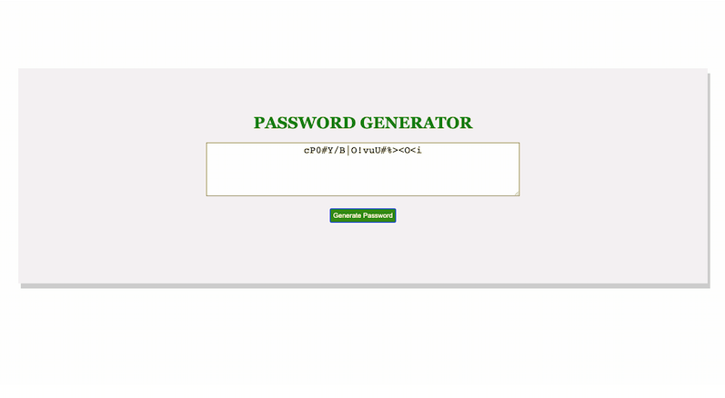
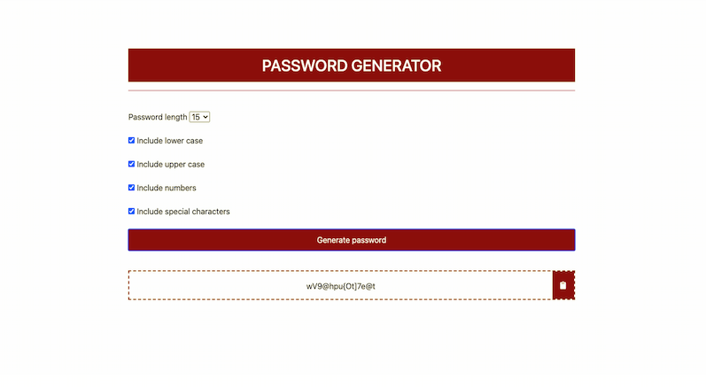

## Purpose

In this project, an application is created to generate a random password based on selected criteria. This application is run in the browser, and will utilize HTML and CSS, powered by JavaScript. 

## Review

There are two versions of this application, one is simple with prompt and one is complex with interative dropdown list and checkboxes.
 
Check out the deploy links of the two versions belows:

* [Version 1](https://uyennguyen30696.github.io/hw3-password-generator/version-01/index1.html)

* [Version 2](https://uyennguyen30696.github.io/hw3-password-generator/version-02/index2.html)

### Version 1

Click the button to generate a password
A series of prompts for password criteria is presented for user to choose from
The criteria includes: 
<ul>
    <li>Password length is between 8 and 128 characters.</li>
    <li>At least one character type should be selected (lowercase, uppercase, numeric, and/or special characters).</li>
    <li>If the password generated matches the selected criteria, it is alerted or displayed on the page.</li>
</ul>

### Version 2

A form in presented to the user to choose the character types for the password, including password length from a dropdown list, lowercase, uppercase, numeric, and special characters in a series of checkboxes. The password length ranges from 8 to 20 characters. A random password is generated which includes the chosen criteria will be displayed in the dashed box at the bottom of the form.
